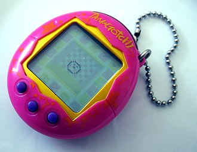

   

      <h1>The Fox Game</h1>
      
Welcome to the Virtual Pet Game project aiming to recreate the experience of taking care of a virtual pet, inspired by Tamagotchi developed in Japan from the 90's.

    

    
     

      
    

    
  

## Game Description
  The Virtual Pet Game is an interactive web-based game where users take care of a virtual pet. Here's what you can expect from the game:

  1. Initialization: The game starts in an initialized state. The user must press the center button to get started.

  2. Interactions: Users can switch between the three icons on the bottom using the left and right buttons. They can press one of the icons by clicking the middle button.

  3. Weather Control: Users can switch the weather from day to rain using the weather icon.

  4. Pet Care: Users need to feed and clean up after their virtual pet based on its needs.

  5. Day and Night Cycle: The game features a day and night cycle where the environment changes accordingly, affecting the pet's behavior.

  6. Modal Instructions: Using a modal, users are instructed to restart the game by pressing the middle button.

## Overview
  The Tamagotchi, a handheld digital pet, debuted in 1996, created by Akihiro Yokoi and Aki Maita. It quickly gained popularity, with over 91 million units sold worldwide by June 2023. The device, resembling an egg, features simple interface buttons. Players nurture virtual pets through various life stages, impacting their development based on care given.

### History
  Invented as a virtual pet simulation game, Tamagotchis were initially marketed to teenage girls in Japan. The concept originated from a desire to explore life on Earth through an alien species' perspective. Successive models introduced new gameplay elements and designs.

### Gameplay
  Upon activation, an egg appears, hatching into a pet after setting the clock. Players manage hunger, happiness, and training meters through feeding, games, and discipline. Pets can fall ill if neglected, requiring care to prevent death. The life cycle progresses through stages like Baby, Child, Teenager, Adult, and Special, influenced by player actions.

### Features
  Recent models offer enhanced features like earning currency, connecting with other devices for interaction, and marriage and offspring mechanics. The introduction of augmented reality in newer models expands gameplay possibilities.

### Releases
  Tamagotchi versions evolved over time, with various themed releases and enhancements. The franchise continued innovating with each iteration, adapting to changing trends and technology.

### Controversy
  Despite its popularity, Tamagotchis faced controversy, including school bans due to distraction and debates over their implications on child development and pet ownership values.

Tamagotchi remains an iconic toy, embodying nostalgia for many, with its enduring legacy spanning multiple generations and cultural impact.

## Getting Started
  To get started with the Virtual Pet Game:
  1. Clone the repository.
  2. Open index.html in your web browser.

